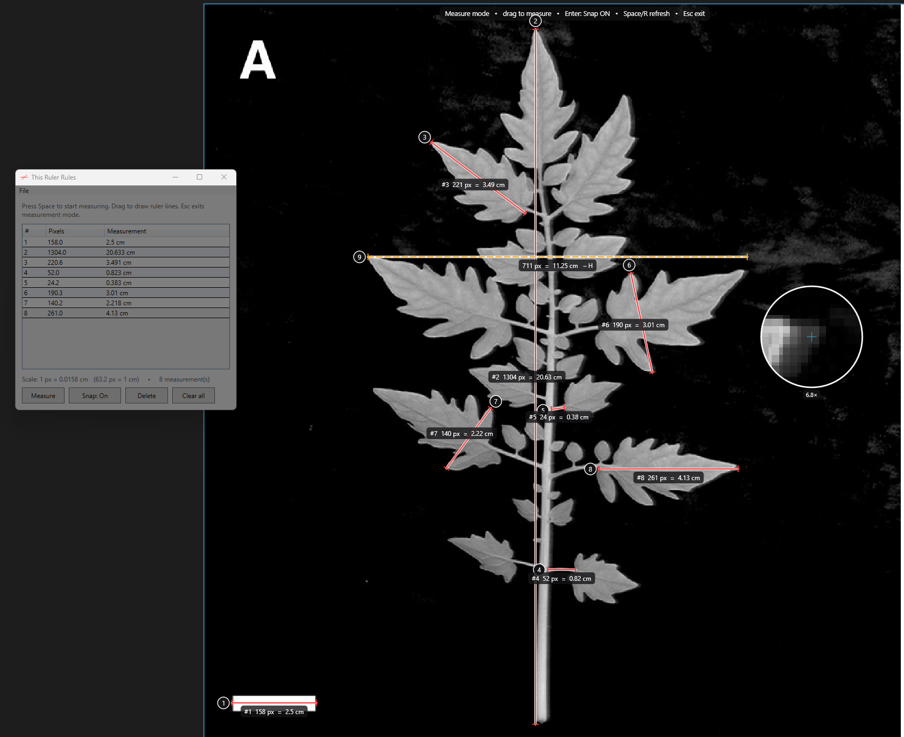

# *This Ruler Rules*

A lightweight on-screen ruler for Windows. Draw lines anywhere on your screen,
measure them in **screen pixels**, calibrate to real-world units, and keep a
numbered list of every measurement.

Built with **WPF on .NET 10** — no NuGet packages, screen capture is done with
plain Win32 GDI, so it runs with nothing to download.



*Measuring leaf features on a calibrated image. Line **#1** was drawn across the
2.5 cm scale bar to set the scale (1 px = 0.0158 cm), so every later line reads
straight out in centimetres. The **loupe** magnifies the cursor 6.8× for
pixel-exact endpoints, line **#9** is snapping horizontally (`711 px = 11.25 cm ─ H`),
and the panel sits at 50% opacity while measuring.*

## Download

Grab `Ruler.exe` from the [latest release](https://github.com/TheSmallKiwi/ThisRulerRules/releases/latest).
It needs the [.NET 10 Desktop Runtime](https://dotnet.microsoft.com/download/dotnet/10.0)
(x64) — that's why it's a ~0.3 MB single file rather than a bundled ~150 MB one.

## Run it

```bash
dotnet run -c Release
```

Or build a standalone executable and launch that:

```bash
dotnet build -c Release
```

Then run `bin\Release\net10.0-windows\Ruler.exe`.

## Workflow

1. **Focus the Ruler window and press `Space`.** A full-screen measurement
   layer switches on and a **magnifier loupe** follows your cursor for
   pixel-precise placement.
2. **Click and drag** to draw a measurement line. It shows the pixel length live
   while you drag, with **mild horizontal / vertical snapping** (within ~7° of an
   axis the line locks straight — you'll see a `─ H` / `│ V` tag). Press `Enter`
   (or the **Snap** button) to turn snapping off for free-angle lines; you can
   toggle it mid-drag and the line re-evaluates immediately.
3. **Release** and, on the *first* measurement, a dialog asks what that span
   represents (e.g. `100` `cm`). That sets the scale for everything.
4. **Keep dragging** to add more lines. They stay on screen, **numbered**, each
   labelled with its pixel length and scaled value.
5. Every measurement lands in a **numbered row** in the panel — pixels and the
   scaled measurement side by side.
6. **`Esc`** (or clicking away to another app) leaves measurement mode. It stays
   off until you focus the Ruler window and press `Space` again.
7. Your drawn lines **stay on screen** after you exit, as a click-through layer —
   you can keep working underneath them. They remain until you **clear** them or
   **minimize** the app (restoring the window brings them back).

### Keys / buttons

| Action | |
|---|---|
| `Space` | Start measuring (from the panel) / refresh the magnifier snapshot (while measuring) |
| `R` | Refresh the magnifier snapshot |
| `Esc` | Exit measurement mode |
| `Enter` | Toggle H/V snapping on or off (works in the panel and mid-drag) |
| **Right-click** | Cancel the line you're currently drawing; if you're not drawing, exit measurement mode |
| **Measure** *(button)* | Same as pressing `Space` |
| **Snap: On/Off** *(button)* | Same toggle as `Enter`; current state also shows in the overlay hint bar |
| **Delete** *(button)* | Remove the selected measurement and renumber |
| **Clear all** *(button)* | Remove everything and reset the scale |
| **File ▸ Set scale…** | Re-calibrate from the selected (or last) measurement; recomputes every row |
| **File ▸ Save PNG…** | Export the numbered lines as a transparent PNG (see below) |
| **File ▸ Save CSV…** | Export the table (index, pixels, scaled, units) |

While measurement mode is active the panel drops to **50% opacity** so it stays
out of your way, and returns to fully opaque when you exit.

Outside measurement mode the lines remain on screen as a passive, click-through
overlay (no magnifier, no hint bar), so they can sit on top of whatever you're
working on. Minimizing the window hides them; restoring brings them back.

### PNG export

**Save PNG…** writes a 32-bit PNG with a transparent background containing just
the numbered lines, tick marks, and labels. It's sized to the bounding box of
your measurements in absolute screen pixels, so if you drop it on top of a
screenshot of what you measured, the lines land exactly where you drew them.
The loupe and the on-screen hint bar are never included.

## How measuring works

The app is *per-monitor DPI aware*, so a "pixel" is a true physical screen
pixel. The magnifier takes a snapshot of the desktop when you start (and on
`Space`/`R`), then shows a nearest-neighbour zoom around the cursor with a
crosshair on the exact pixel. Scale is stored as *units per pixel*
(`entered value ÷ measured pixels`) and applied to every line.

## Notes / limitations

- **Multi-monitor aware.** When you press `Space`, the overlay covers whichever
  monitor the cursor is on, at that monitor's true resolution and DPI (mixed
  scaling like 100% + 150% is handled). One monitor per session — to measure on
  another display, `Esc`, move the cursor there, and press `Space` again.
- Measurements are stored in **absolute screen pixels**, so the numbered list can
  hold lines drawn on different monitors.
- The magnifier shows a **snapshot** of the screen taken when you activate. If
  the content underneath changes (video, scrolling), press `Space`/`R` to
  refresh it. Your drawn lines are always composited live into the loupe.
- Lines are anchored to **screen coordinates**, not to the content beneath them,
  so scrolling the underlying window won't move the lines.
- A small diagnostic log is written to `%TEMP%\RulerLog.txt` (records the monitor
  and whether the overlay is catching clicks) — handy if anything misbehaves.

## Project layout

| File | |
|---|---|
| `Program.cs` | Entry point, `ControlPanel` window, `Measurement` / `Calibration` models |
| `Overlay.cs` | Transparent full-screen overlay + magnifier / drawing canvas |
| `ScaleDialog.cs` | The scale + units prompt |
| `Native.cs` | Win32 screen capture and cursor position |
| `MeasureRender.cs` | Shared line drawing + transparent-PNG export |
| `SelfTest.cs` | `Ruler.exe --selftest <dir>` renders the UI to PNGs (dev check) |
| `app.manifest` | Per-monitor-v2 DPI awareness |
| `icon.ico` | App icon — two intersecting ruler lines (16–256 px) |

## License

[MIT](LICENSE)
